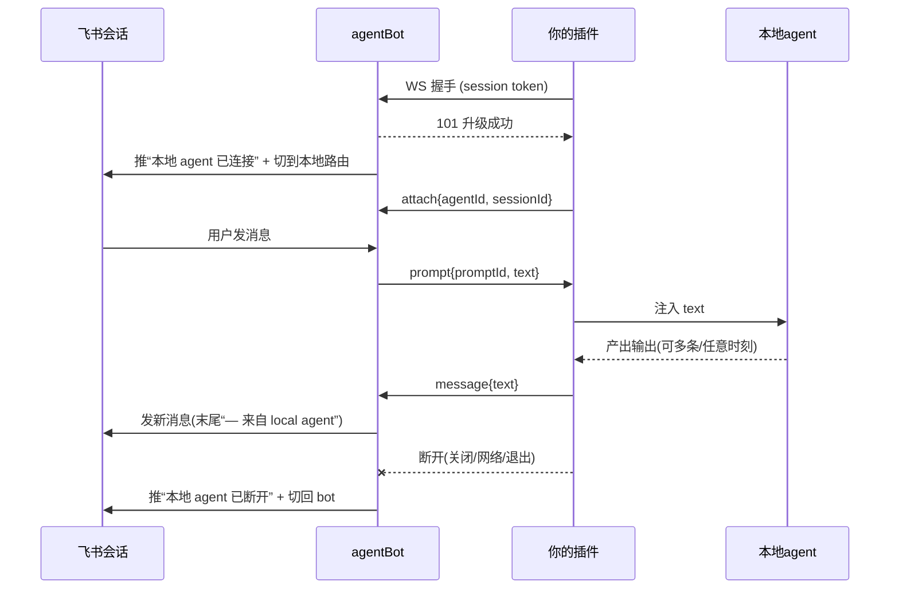

# Remote Agent Plugin Protocol

本文是「本地 agent 插件」接入 agent-bot 的完整协议规范。目标读者是要为某个本地 agent（opencode / Cursor / Claude Code / 自研 agent 等）实现插件的人或 agent。按本文实现即可，无需阅读 agent-bot 源码。

## 它能做什么

把一个飞书会话变成你电脑上某个本地 agent 会话的「远程镜像 + 遥控」：

- 你在飞书里发的消息 → agent-bot 通过 WebSocket 推给你的插件 → 插件注入本地 agent 会话。
- 本地 agent 产出的输出 → 插件通过 WebSocket 上报 → agent-bot 发到飞书会话（末尾自动带 `— 来自 local agent` 标注）。

本地会话是「主」，agent-bot 只是一条转发通道。插件决定「把本地的什么内容镜像出去」（最终回答 / 中间过程 / 工具活动等都由你定）。

## 核心模型（先理解这几条）

- **连接即绑定**：插件用某个飞书会话的 session token 连上 WS，这条连接就绑定到那个会话。无需再单独传会话 id。
- **1:1**：一个飞书会话同一时刻只镜像一个本地 session。
- **受开关 gate**：会话必须先开启 `settings.remoteEnabled=true`，否则插件连不进来（握手被拒）。
- **自动切换**：插件一连上，agent-bot 自动把该会话切到「本地路由」；插件断开，自动切回 bot。断开期间飞书消息回退给 bot 正常回答，不会丢给你。
- **异步、非请求响应**：agent-bot 把飞书消息投给你就返回，不等你回复。你的输出什么时候产生、产生几条，都由你随时上报，不必和某条输入一一对应。

## 1. 建立连接

### URL

```
GET {AGENT_BOT_BASE}/api/v1/remote-agent/ws
```

`{AGENT_BOT_BASE}` 是 agent-bot 本地 API 地址（默认 `http://127.0.0.1:8080`，部署在远端时换成对应 host）。用 `ws://` 或 `wss://` scheme 发起 WebSocket 握手。

### 鉴权

用目标飞书会话的 **session token**（在该会话里发 `/info`，取回复里的 `session_web_token`，形如 `abt_sess_xxx`）。二选一：

- Query 参数：`?token=abt_sess_xxx`
- 或请求头：`Authorization: Bearer abt_sess_xxx`（推荐，避免 token 出现在 URL / 代理日志里）

只接受 session token；项目级 token 会被拒。

### 握手期可能的失败（升级前返回 HTTP，不会切到 WS）

| HTTP 状态 | body `error` | 含义 | 你该怎么做 |
| --- | --- | --- | --- |
| 101 | （无） | 升级成功 | 进入消息循环 |
| 401 | `session token store is not configured` | 服务端没配 auth secret | 联系部署方 |
| 401 | （token 校验错误信息） | token 无效/过期 | 重新从 `/info` 取 token |
| 403 | `a session token is required` | 用的不是 session token | 换成会话的 session token |
| 403 | `remote agent is not enabled for this conversation` | 会话没开 `remoteEnabled` | 先在会话 `.session-setting.json` 设 `settings.remoteEnabled=true` 并 rebuild |
| 503 | `remote agent endpoint is not enabled` | 该 agent-bot 没启用本功能 | 联系部署方 |

WebSocket 客户端库通常会把这些握手失败暴露成「带状态码和 body 的连接错误」。

## 2. 连上之后做的第一件事：attach

连接成功后，**立即发一条 `attach`**，声明你这条连接对应的本地 agent 和本地 session：

```json
{ "type": "attach", "agentId": "macbook", "sessionId": "local-session-123", "title": "repo: agent-bot" }
```

- 在 1:1 模型下 `sessionId` 主要用于回显和展示，agent-bot 不依赖它路由；但建议如实填，便于排查与未来扩展。
- 本地切到另一个 session 时，再发一条新的 `attach` 覆盖即可（最新的生效）。

> 注意：连接成功时，agent-bot 会往飞书会话推一条「本地 agent 已连接」提示并自动切到本地路由——这一步发生在飞书侧，插件这边不会收到任何东西，所以不要等 server 先发消息，要主动 attach。

## 3. 消息协议

全部是 WebSocket **文本帧（text frame）**，payload 是一行 JSON，按 `type` 分发。

### 插件 → agent-bot

#### `attach`

| 字段 | 类型 | 必填 | 说明 |
| --- | --- | --- | --- |
| `type` | string | 是 | 固定 `"attach"` |
| `agentId` | string | 否 | 本地 agent 标识，仅展示/日志用（如 `macbook`、`cursor`） |
| `sessionId` | string | 否 | 当前本地 session id |
| `title` | string | 否 | 展示用标题 |

#### `message`（把本地输出推给飞书）

| 字段 | 类型 | 必填 | 说明 |
| --- | --- | --- | --- |
| `type` | string | 是 | 固定 `"message"` |
| `sessionId` | string | 否 | 产生该输出的本地 session id |
| `text` | string | 是 | 要发到飞书的文本；为空会被忽略 |

agent-bot 会原样把 `text` 发到飞书会话，并在末尾追加 `\n\n— 来自 local agent`。文本帧大小上限 **1 MiB**，超过会被服务端断开连接；过长内容请自行分条发多次 `message`。

### agent-bot → 插件

#### `prompt`（飞书来的消息，注入本地 session）

| 字段 | 类型 | 说明 |
| --- | --- | --- |
| `type` | string | 固定 `"prompt"` |
| `promptId` | string | 该 prompt 的唯一 id，便于你做幂等/关联 |
| `sessionId` | string | 你最近一次 `attach` 的 sessionId（未 attach 则为空串） |
| `text` | string | 用户在飞书发的文本，注入本地 agent 会话即可 |

收到 `prompt` 后把 `text` 喂给本地 agent。**不需要 ack**；agent-bot 投递后即返回，不等待。本地随后产生的输出，由你用 `message` 上报。

> 飞书侧 UX：消息下发给你时，agent-bot 会给那条飞书消息加一个「处理中」reaction（emoji 由平台配置 `providers.feishu.remoteAckEmoji` 决定，未配置时等于普通 `ackEmoji`）。你回投**任意**一条 `message` 时，平台会清掉该会话当前挂起的这些 reaction；插件断开时也会清。这是会话级、尽力而为的提示，插件无需为它做任何事。

> 注意：飞书侧的平台命令（`/help`、`/info`、`/new`、`/connect-bot` 等）和 `before_message.py` 已经在 agent-bot 内处理掉了，不会作为 `prompt` 下发给你；你只会收到要交给本地 agent 的正常消息文本。

## 4. 生命周期时序



## 5. 保活（keepalive）—— 必须处理

agent-bot 作为服务端会：

- 每 **54 秒**向插件发一个 WebSocket **PING** 控制帧。
- 维护一个 **60 秒**读超时，并在每次收到插件的 **PONG** 时重置它。

因此你的客户端必须**自动回应 PING（用 PONG）**，否则约 60 秒后会被服务端断开——注意：发普通 `message` 数据帧**不会**重置这个超时，只有 PONG 会。绝大多数 WebSocket 库默认会自动回 PONG，但前提是你要持续处于「读」状态（保持一个读循环在跑）。如果你的库不自动回 PONG，就需要手动处理 ping 帧。

## 6. 重连与顶替

- **重连**：连接断了就重连，重连成功后重新发 `attach`。断开期间到达的飞书消息会走 bot，不会缓存补发，所以无需补偿逻辑。建议加指数退避。
- **顶替（takeover）**：如果用同一个会话 token 再开一条新连接，agent-bot 会**静默替换**旧连接并关掉旧的（场景：换了电脑/重启插件）。所以同一会话只保留最后一条连接是活的；旧连接会收到关闭，按重连逻辑处理即可（但别和新连接抢同一会话）。

## 7. 手动切换（飞书侧，了解即可）

用户可在飞书里手动控制路由，插件不用处理这些命令，但要知道效果：

- `/connect-bot`：即使插件还连着，也把会话切回 bot；此时你发的 `message` 仍会被送达飞书，但用户发的消息会走 bot、不再下发 `prompt` 给你。
- `/connect-local`：切回本地（要求插件在线）。
- `/disconnect-local`：与 `/connect-bot` 不同，它会**从服务端主动关闭你的 WS 连接**。你会看到连接被关闭（读循环返回 / close 帧），随后你发的 `message` 也无法送达。如果你实现了自动重连，会重新连上并再次接管（每次新连接都会把路由重置回本地）；若希望「断开后保持断开」，请在收到服务端关闭时不要立即重连。
- 「最后事件/命令 wins」：连接/断开事件与手动命令，谁最后发生听谁的。重连（断开+连上）会自动回到本地。

## 8. 最小参考实现

### Python（`websocket-client`）

```python
import json
import websocket  # pip install websocket-client

BASE = "ws://127.0.0.1:8080"
TOKEN = "abt_sess_xxx"  # 来自目标会话的 /info

def on_open(ws):
    ws.send(json.dumps({"type": "attach", "agentId": "macbook", "sessionId": "local-1"}))

def on_message(ws, raw):
    msg = json.loads(raw)
    if msg.get("type") == "prompt":
        text = msg.get("text", "")
        # TODO: 把 text 喂给本地 agent；产出后调用 send_output(ws, output)
        reply = run_local_agent(text)
        send_output(ws, reply)

def send_output(ws, text):
    ws.send(json.dumps({"type": "message", "sessionId": "local-1", "text": text}))

# Authorization 头优先；header 形式避免 token 进 URL 日志
ws = websocket.WebSocketApp(
    f"{BASE}/api/v1/remote-agent/ws",
    header=[f"Authorization: Bearer {TOKEN}"],
    on_open=on_open,
    on_message=on_message,
)
# run_forever 默认会自动回应 PING(PONG)；设置 ping/超时按需
ws.run_forever(reconnect=5)
```

### Node.js（`ws`）

```js
const WebSocket = require('ws'); // npm i ws

const BASE = 'ws://127.0.0.1:8080';
const TOKEN = 'abt_sess_xxx';

function connect() {
  const ws = new WebSocket(`${BASE}/api/v1/remote-agent/ws`, {
    headers: { Authorization: `Bearer ${TOKEN}` },
  });

  ws.on('open', () => {
    ws.send(JSON.stringify({ type: 'attach', agentId: 'macbook', sessionId: 'local-1' }));
  });

  ws.on('message', async (raw) => {
    const msg = JSON.parse(raw.toString());
    if (msg.type === 'prompt') {
      const out = await runLocalAgent(msg.text); // 注入本地 agent，取回输出
      ws.send(JSON.stringify({ type: 'message', sessionId: 'local-1', text: out }));
    }
  });

  // ws 库会自动回应 PING；断线重连自己加退避
  ws.on('close', () => setTimeout(connect, 3000));
  ws.on('error', () => {});
}

connect();
```

## 9. 接入自检清单

1. 在目标飞书会话把 `.session-setting.json` 的 `settings.remoteEnabled` 设为 `true` 并 rebuild。
2. 在该会话发 `/info`，记下 `session_web_token`。
3. 插件用该 token 连 `GET /api/v1/remote-agent/ws`（Authorization 头优先）。
4. 连上后立即发 `attach`。
5. 在飞书会话发一句话 → 插件应收到 `prompt`，注入本地 agent。
6. 本地 agent 产出后，用 `message` 上报 → 飞书应收到带 `— 来自 local agent` 的新消息。
7. 关掉插件 → 飞书应出现「本地 agent 已断开」，之后消息回到 bot。
8. 长挂 ≥ 1 分钟确认不被踢（PING/PONG 正常）。

## 10. 约束与边界（当前版本）

- 仅文本：`prompt` 和 `message` 都是纯文本，暂不支持图片/附件透传。
- 单条 `message` ≤ 1 MiB；超长请分条发。
- 定时任务（scheduler）和 CLI `session prompt` 不走本地路由，始终发给默认 backend，即不会通过 `prompt` 下发给插件。
- 出站不做去重/重试，`message` 顺序按你发送顺序、按单连接保证。
